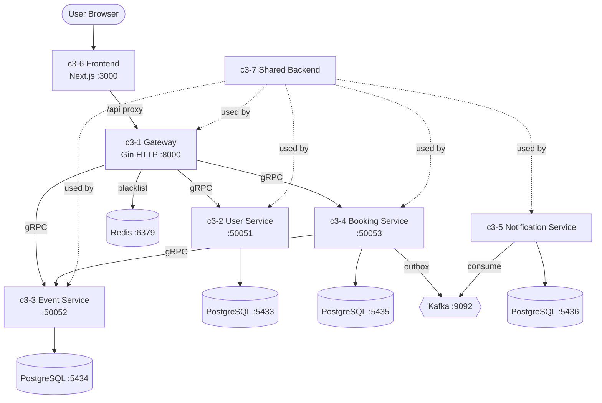

# TicketBox

## Goal

Solve the double booking problem under high concurrency (100K+ simultaneous users) with a scalable microservices architecture

## Overview

## Abstract Constraints

| Constraint | Rationale | Affected Containers |
|------------|-----------|---------------------|
| No double bookings | Core business invariant — concurrent users must never book the same seat | c3-3, c3-4 |
| Per-service database isolation | Independent scaling and data ownership | c3-2, c3-3, c3-4, c3-5 |
| gRPC inter-service communication | Type-safe contracts, efficient binary protocol | c3-1, c3-2, c3-3, c3-4 |
| JWT stateless authentication | Scalable auth without server-side sessions | c3-1, c3-2 |
| 100K+ concurrent user support | System must handle peak load without data corruption | c3-3, c3-4 |

## Containers

| ID | Name | Boundary | Status | Responsibilities | Goal Contribution |
|----|------|----------|--------|------------------|-------------------|
| c3-1 | Gateway | service | active | HTTP→gRPC translation, JWT enforcement, CORS | Routes external HTTP requests to internal gRPC services with auth |
| c3-2 | User Service | service | active | User identity, auth tokens, profiles | Manages authentication so booking flows have verified users |
| c3-3 | Event Service | service | active | Event CRUD, ticket tier management, atomic availability | Enforces availability invariant via row-level locking |
| c3-4 | Booking Service | service | active | Transactional booking creation, booking lifecycle | Orchestrates the booking transaction across services |
| c3-5 | Notification Service | worker | active | Async event consumption, notification persistence | Decouples notification delivery from booking critical path |
| c3-6 | Frontend | app | active | User interface, state management, API integration | Provides the user-facing booking experience |
| c3-7 | Shared Backend | library | active | Config, DB helpers, Kafka, gRPC middleware, proto | Common infrastructure enabling consistent service behavior |
