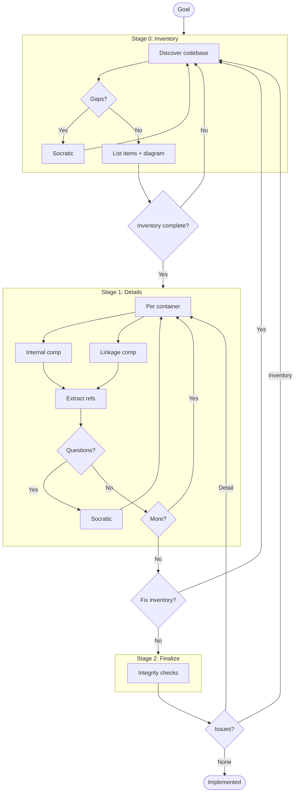
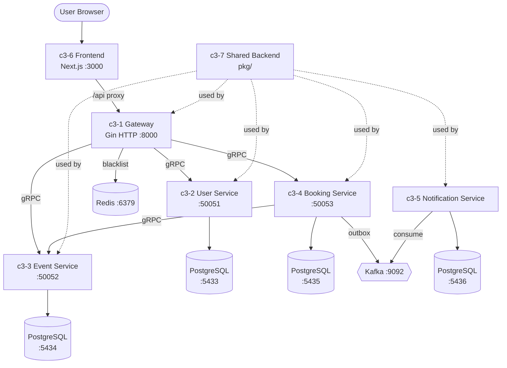

# C3 Architecture Documentation Adoption

## Goal

Adopt C3 methodology for booking.

<!--
EXIT CRITERIA (all must be true to mark implemented):
- All containers documented with Goal Contribution
- All components documented with Container Connection
- Refs extracted for repeated patterns
- Integrity checks pass
- Audit passes
-->

## Workflow

---

## Stage 0: Inventory

<!--
DISCOVER everything first. Don't document yet.
- Auto-discover codebase structure
- Use AskUserQuestion for gaps
- Identify refs that span across items
- Exit: All items listed with arguments for templates
-->

### Context Discovery

| Arg | Value |
|-----|-------|
| PROJECT | TicketBox |
| GOAL | Solve the double booking problem under high concurrency (100K+ simultaneous users) with a scalable microservices architecture |
| SUMMARY | Ticket booking platform with Go gRPC microservices backend, Next.js frontend, per-service PostgreSQL, and Kafka for async events |

### Abstract Constraints

| Constraint | Rationale | Affected Containers |
|------------|-----------|---------------------|
| No double bookings | Core business invariant — two users must never book the same seat | c3-3-event-service, c3-4-booking-service |
| Per-service database isolation | Each service owns its data to enable independent scaling | c3-2-user-service, c3-3-event-service, c3-4-booking-service, c3-5-notification-service |
| gRPC for inter-service communication | Type-safe contracts, efficient binary protocol for internal traffic | All backend services |
| JWT stateless auth | Scalable authentication without server-side sessions | c3-1-gateway, c3-2-user-service |
| 100K+ concurrent user support | System must handle peak load without data corruption | c3-3-event-service, c3-4-booking-service |

### Container Discovery

| N | CONTAINER_NAME | BOUNDARY | GOAL | SUMMARY |
|---|----------------|----------|------|---------|
| 1 | gateway | service | Route HTTP requests to backend gRPC services with auth enforcement | Gin HTTP gateway (:8000) translating REST to gRPC, JWT validation via middleware, Redis token blacklist |
| 2 | user-service | service | Manage user identity, authentication, and profiles | gRPC service (:50051) handling register/login/refresh/logout and profile CRUD, DB: ticketbox_user |
| 3 | event-service | service | Manage events and enforce ticket availability with row-level locking | gRPC service (:50052) with atomic availability updates via SELECT FOR UPDATE, DB: ticketbox_event |
| 4 | booking-service | service | Create and manage bookings transactionally with concurrency control | gRPC service (:50053) coordinating with event-service for availability, DB: ticketbox_booking |
| 5 | notification-service | worker | Consume booking events and persist notifications | Kafka consumer (no gRPC port), DB: ticketbox_notification |
| 6 | frontend | app | Provide the user-facing booking experience with offline fallback | Next.js 16 App Router (:3000) with auth/booking contexts, API proxy to gateway |
| 7 | shared-backend | library | Provide common infrastructure used by all backend services | Go packages: config, database, kafka, gRPC middleware, generated protobuf code |

### Component Discovery (Brief)

| N | NN | COMPONENT_NAME | CATEGORY | GOAL | SUMMARY |
|---|----|----|----------|------|---------|
| 1 | 01 | http-router | foundation | Define HTTP routes and middleware chain | Gin router setup with CORS, auth, admin middleware |
| 1 | 02 | auth-middleware | foundation | Validate JWT tokens and enforce auth | JWT parsing, Redis blacklist check, role extraction |
| 1 | 10 | auth-handler | feature | Expose auth endpoints via HTTP | Register/login/refresh/logout handlers |
| 1 | 11 | event-handler | feature | Expose event endpoints via HTTP | CRUD events, availability queries |
| 1 | 12 | booking-handler | feature | Expose booking endpoints via HTTP | Create/get/list/cancel bookings |
| 1 | 13 | user-handler | feature | Expose user profile endpoints via HTTP | Get/update profile |
| 2 | 01 | user-grpc-server | foundation | Implement UserService gRPC interface | Protobuf service implementation |
| 2 | 02 | user-repository | foundation | Persist user data in PostgreSQL | PGX-based CRUD with password hashing |
| 2 | 10 | auth-logic | feature | Handle authentication flows | Register, login, JWT generation, refresh tokens |
| 2 | 11 | profile-management | feature | Handle profile operations | Get/update user profile |
| 3 | 01 | event-grpc-server | foundation | Implement EventService gRPC interface | Protobuf service implementation |
| 3 | 02 | event-repository | foundation | Persist event data with row-level locking | PGX-based CRUD with SELECT FOR UPDATE |
| 3 | 10 | event-crud | feature | Manage event lifecycle | Create/read/update/delete events and tiers |
| 3 | 11 | ticket-availability | feature | Enforce atomic availability updates | Row-level locking or optimistic versioning |
| 4 | 01 | booking-grpc-server | foundation | Implement BookingService gRPC interface | Protobuf service implementation |
| 4 | 02 | booking-repository | foundation | Persist booking data with outbox | PGX-based CRUD with outbox table writes |
| 4 | 10 | booking-creation | feature | Orchestrate transactional booking creation | Calls event-service for availability, creates booking |
| 4 | 11 | booking-management | feature | Handle booking queries and cancellation | Get/list/cancel bookings |
| 5 | 01 | kafka-consumer | foundation | Consume events from Kafka topics | Kafka consumer group setup |
| 5 | 02 | notification-repository | foundation | Persist notifications in PostgreSQL | PGX-based notification storage |
| 5 | 10 | notification-processing | feature | Process booking events into notifications | Transform Kafka messages to stored notifications |
| 6 | 01 | api-client | foundation | HTTP client with JWT token management | Singleton client, auto-refresh on 401, proxy via Next.js rewrites |
| 6 | 02 | auth-state | foundation | Global authentication state management | AuthProvider context with login/register/logout |
| 6 | 03 | booking-state | foundation | Global event and cart state management | BookingProvider context with mock data fallback |
| 6 | 04 | data-transformers | foundation | Convert API types to frontend types | cents→dollars, snake_case→camelCase, date formatting |
| 6 | 10 | event-browsing | feature | Display event listings and search | Home page hero, event grid, filtering |
| 6 | 11 | event-detail | feature | Show event detail and seat selection | Event page, interactive SVG venue map |
| 6 | 12 | checkout | feature | Cart and purchase flow | Checkout page, booking creation |
| 6 | 13 | my-tickets | feature | Display purchased ticket history | Ticket listing with status |
| 6 | 14 | auth-pages | feature | Login and registration forms | Login/register pages |
| 7 | 01 | config | foundation | Environment-based configuration loading | Viper config with SERVICE_NAME, ports, DB URLs |
| 7 | 02 | database | foundation | PostgreSQL connection pool helper | PGX pool creation and management |
| 7 | 03 | kafka-pkg | foundation | Kafka producer and consumer utilities | Shared producer/consumer setup |
| 7 | 04 | grpc-middleware | foundation | gRPC logging interceptor | Unary interceptor with structured logging |
| 7 | 05 | proto-generated | foundation | Generated protobuf Go code | Service stubs for user/event/booking |

### Ref Discovery

| SLUG | TITLE | GOAL | Scope | Applies To |
|------|-------|------|-------|------------|
| grpc-service-structure | gRPC Service Structure | Enforce consistent service layout | backend | c3-2, c3-3, c3-4, c3-5 |
| repository-pattern | Repository Pattern | Separate data access from business logic | backend | All backend services |
| jwt-auth-flow | JWT Authentication Flow | Consistent auth across frontend and gateway | system | c3-1, c3-2, c3-6 |
| data-shape-mapping | Data Shape Mapping | Transform between API and frontend types | system | c3-1, c3-6, c3-7 |
| concurrency-control | Concurrency Control | Prevent double bookings under high load | backend | c3-3, c3-4 |
| outbox-pattern | Outbox Pattern | Reliable async event publishing | backend | c3-4, c3-5 |
| mock-data-fallback | Mock Data Fallback | Enable frontend development without backend | frontend | c3-6 |

### Overview Diagram

### Gate 0

- [x] Context args filled
- [x] Abstract Constraints identified
- [x] All containers identified with args (including BOUNDARY)
- [x] All components identified (brief) with args and category
- [x] Cross-cutting refs identified
- [x] Overview diagram generated

---

## Stage 1: Details

All 7 container READMEs, 35 component docs, and 7 ref docs created and filled.

### Gate 1

- [x] All container README.md created
- [x] All component docs created
- [x] All refs documented
- [x] No new items discovered

---

## Stage 2: Finalize

### Code-Map

- [x] Code-map scaffolded and patterns filled
- [x] Coverage: 100% (59 mapped, 91 excluded, 0 unmapped)

### Integrity Checks

| Check | Status |
|-------|--------|
| Context ↔ Container (all 7 containers listed in c3-0) | [x] |
| Container ↔ Component (all 35 components in container READMEs) | [x] |
| Component ↔ Component (dependencies documented) | [x] |
| * ↔ Refs (7 refs cited in component Related Refs) | [x] |

### Gate 2

- [x] All integrity checks pass
- [x] Coverage at 100%
- [x] c3x list shows complete topology

---

## Exit

Status: `implemented`

## Audit Record

| Phase | Date | Notes |
|-------|------|-------|
| Adopted | 20260311 | Initial C3 structure created |
| Inventory | 20260311 | 7 containers, 35 components, 7 refs discovered |
| Details | 20260311 | All docs filled with goals, dependencies, code refs |
| Finalized | 20260311 | Code-map 100% coverage, structural checks pass |
