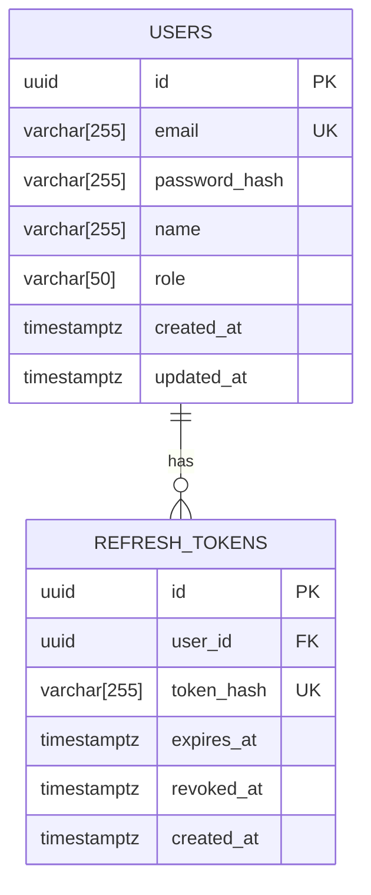
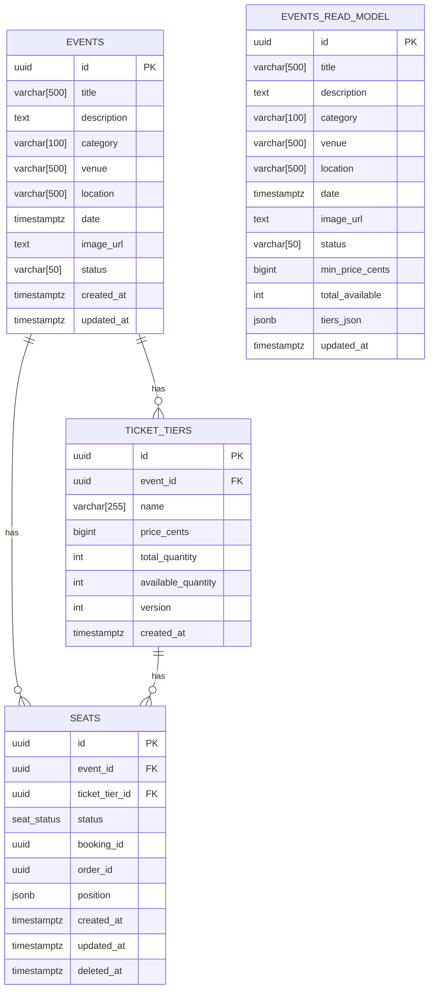
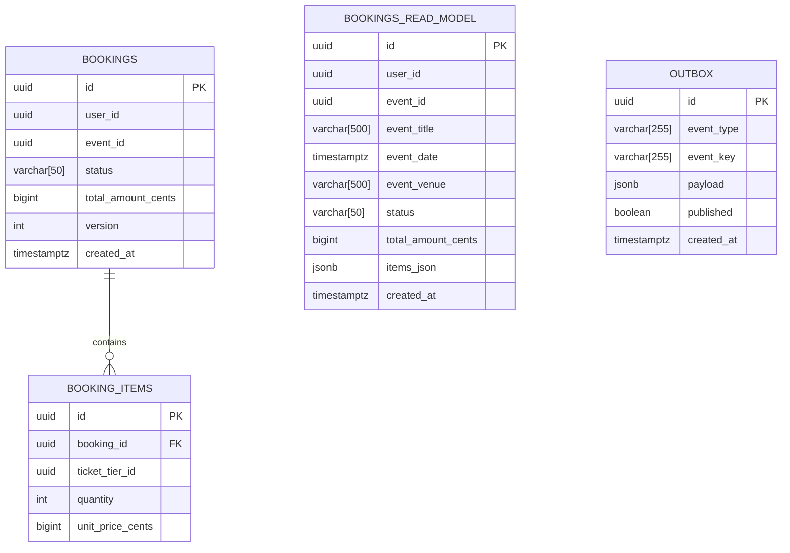
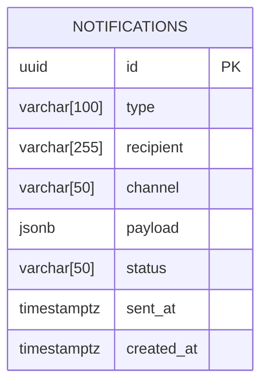
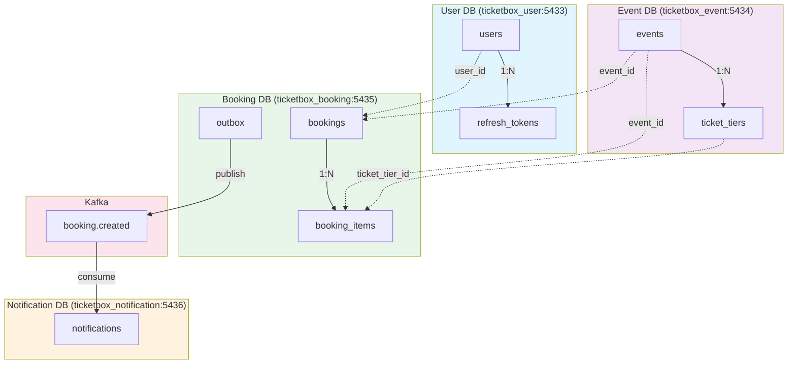
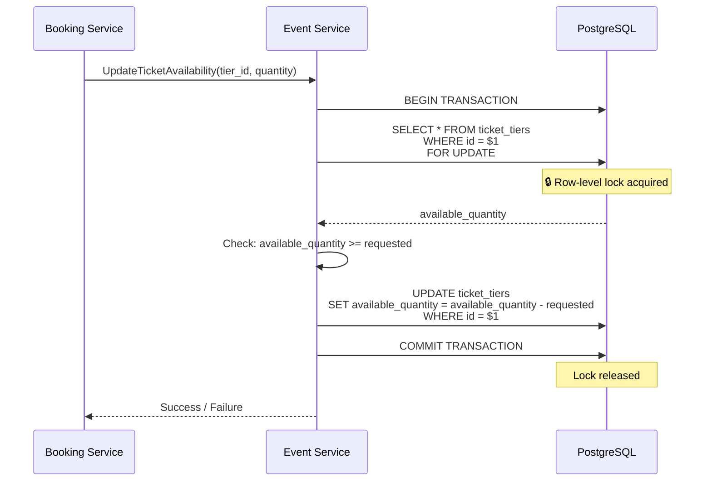

# TicketBox Database ERD Documentation

## Overview

TicketBox uses a **microservices database-per-service** architecture. Each service has its own PostgreSQL database:

| Database | Port | Purpose |
|----------|------|---------|
| `ticketbox_user` | 5433 | User authentication & profiles |
| `ticketbox_event` | 5434 | Events, venues, ticket tiers & availability |
| `ticketbox_booking` | 5435 | Bookings, booking items, outbox pattern |
| `ticketbox_notification` | 5436 | Notification queue for Kafka consumption |

---

## 1. User Service Database (`ticketbox_user`)

### Schema Diagram



### Tables

#### `users`
| Column | Type | Constraints | Description |
|--------|------|-------------|-------------|
| `id` | UUID | PRIMARY KEY, DEFAULT uuid_generate_v4() | User unique identifier |
| `email` | VARCHAR(255) | UNIQUE, NOT NULL | User email address (login) |
| `password_hash` | VARCHAR(255) | NOT NULL | Bcrypt hashed password |
| `name` | VARCHAR(255) | NOT NULL | Full user name |
| `role` | VARCHAR(50) | NOT NULL, DEFAULT 'user' | User role ('user', 'admin') |
| `created_at` | TIMESTAMPTZ | NOT NULL, DEFAULT NOW() | Account creation timestamp |
| `updated_at` | TIMESTAMPTZ | NOT NULL, DEFAULT NOW() | Last profile update |

**Indexes:**
- `idx_users_email` on `email`

#### `refresh_tokens`
| Column | Type | Constraints | Description |
|--------|------|-------------|-------------|
| `id` | UUID | PRIMARY KEY, DEFAULT uuid_generate_v4() | Token identifier |
| `user_id` | UUID | NOT NULL, FK→users(id) ON DELETE CASCADE | Associated user |
| `token_hash` | VARCHAR(255) | UNIQUE, NOT NULL | Hashed refresh token |
| `expires_at` | TIMESTAMPTZ | NOT NULL | Token expiration |
| `revoked_at` | TIMESTAMPTZ | NULLABLE | Revocation timestamp (NULL if active) |
| `created_at` | TIMESTAMPTZ | NOT NULL, DEFAULT NOW() | Token issuance time |

**Indexes:**
- `idx_refresh_tokens_user_id` on `user_id`
- `idx_refresh_tokens_token_hash` on `token_hash`

---

## 2. Event Service Database (`ticketbox_event`)

### Schema Diagram



### Tables

#### `events`
| Column | Type | Constraints | Description |
|--------|------|-------------|-------------|
| `id` | UUID | PRIMARY KEY, DEFAULT uuid_generate_v4() | Event unique identifier |
| `title` | VARCHAR(500) | NOT NULL | Event name |
| `description` | TEXT | | Event details |
| `category` | VARCHAR(100) | NOT NULL | Event category (concert, sports, theater, etc.) |
| `venue` | VARCHAR(500) | NOT NULL | Venue name |
| `location` | VARCHAR(500) | NOT NULL | Full address/location |
| `date` | TIMESTAMPTZ | NOT NULL | Event datetime |
| `image_url` | TEXT | | Promo image URL |
| `status` | VARCHAR(50) | NOT NULL, DEFAULT 'active' | 'active', 'cancelled', 'sold_out' |
| `created_at` | TIMESTAMPTZ | NOT NULL, DEFAULT NOW() | Creation timestamp |
| `updated_at` | TIMESTAMPTZ | NOT NULL, DEFAULT NOW() | Last update |

**Indexes:**
- `idx_events_category` on `category`
- `idx_events_date` on `date`
- `idx_events_status` on `status`

#### `ticket_tiers`
| Column | Type | Constraints | Description |
|--------|------|-------------|-------------|
| `id` | UUID | PRIMARY KEY, DEFAULT uuid_generate_v4() | Tier identifier |
| `event_id` | UUID | NOT NULL, FK→events(id) ON DELETE CASCADE | Parent event |
| `name` | VARCHAR(255) | NOT NULL | Tier name (VIP, General, etc.) |
| `price_cents` | BIGINT | NOT NULL | Price in cents (e.g., 5000 = $50.00) |
| `total_quantity` | INT | NOT NULL | Total tickets for this tier |
| `available_quantity` | INT | NOT NULL | Currently available (locked with `SELECT FOR UPDATE`) |
| `version` | INT | NOT NULL, DEFAULT 1 | Optimistic locking version |
| `created_at` | TIMESTAMPTZ | NOT NULL, DEFAULT NOW() | Tier creation |

**Indexes:**
- `idx_ticket_tiers_event_id` on `event_id`

**Critical Note:** `available_quantity` is updated using `SELECT FOR UPDATE` row-level locking to prevent double-booking under high concurrency.

#### `seats`
Individual seat tracking for venue layouts with reserved seating.

| Column | Type | Constraints | Description |
|--------|------|-------------|-------------|
| `id` | UUID | PRIMARY KEY, DEFAULT uuid_generate_v4() | Seat identifier |
| `event_id` | UUID | NOT NULL, FK→events(id) ON DELETE CASCADE | Parent event |
| `ticket_tier_id` | UUID | NOT NULL, FK→ticket_tiers(id) ON DELETE CASCADE | Associated ticket tier |
| `status` | seat_status | NOT NULL, DEFAULT 'available' | 'available', 'reserved', 'booked' |
| `booking_id` | UUID | | Associated booking when booked |
| `order_id` | UUID | | Order identifier for tracking |
| `position` | JSONB | | Seat position (row, seat number, coordinates) |
| `created_at` | TIMESTAMPTZ | NOT NULL, DEFAULT NOW() | Creation timestamp |
| `updated_at` | TIMESTAMPTZ | NOT NULL, DEFAULT NOW() | Last update |
| `deleted_at` | TIMESTAMPTZ | | Soft delete timestamp |

**Indexes:**
- `idx_seats_event_id` on `event_id`
- `idx_seats_ticket_tier_id` on `ticket_tier_id`
- `idx_seats_status` on `status`
- `idx_seats_booking_id` on `booking_id` WHERE `booking_id IS NOT NULL`

#### `events_read_model`
Materialized view for efficient event listing with pre-aggregated data.

| Column | Type | Constraints | Description |
|--------|------|-------------|-------------|
| `id` | UUID | PRIMARY KEY | Event ID (denormalized) |
| `title`, `description`, `category`, `venue`, `location`, `date`, `image_url`, `status` | — | — | Denormalized from `events` |
| `min_price_cents` | BIGINT | | Minimum tier price for filtering |
| `total_available` | INT | | Sum of all tier availability |
| `tiers_json` | JSONB | | Pre-computed tier data for frontend |
| `updated_at` | TIMESTAMPTZ | NOT NULL | Last sync timestamp |

---

## 3. Booking Service Database (`ticketbox_booking`)

### Schema Diagram



### Tables

#### `bookings`
| Column | Type | Constraints | Description |
|--------|------|-------------|-------------|
| `id` | UUID | PRIMARY KEY, DEFAULT uuid_generate_v4() | Booking identifier |
| `user_id` | UUID | NOT NULL | User ID (from User Service, no FK) |
| `event_id` | UUID | NOT NULL | Event ID (from Event Service, no FK) |
| `status` | VARCHAR(50) | NOT NULL, DEFAULT 'PENDING' | 'PENDING', 'CONFIRMED', 'CANCELLED' |
| `total_amount_cents` | BIGINT | NOT NULL, DEFAULT 0 | Total booking cost |
| `version` | INT | NOT NULL, DEFAULT 1 | Optimistic locking |
| `created_at` | TIMESTAMPTZ | NOT NULL, DEFAULT NOW() | Booking creation |

**Indexes:**
- `idx_bookings_user_id` on `user_id`
- `idx_bookings_event_id` on `event_id`
- `idx_bookings_status` on `status`

#### `booking_items`
Line items for each booking (multi-tier purchases).

| Column | Type | Constraints | Description |
|--------|------|-------------|-------------|
| `id` | UUID | PRIMARY KEY, DEFAULT uuid_generate_v4() | Item identifier |
| `booking_id` | UUID | NOT NULL, FK→bookings(id) ON DELETE CASCADE | Parent booking |
| `ticket_tier_id` | UUID | NOT NULL | Tier ID (from Event Service, no FK) |
| `quantity` | INT | NOT NULL | Number of tickets |
| `unit_price_cents` | BIGINT | NOT NULL | Price per ticket (snapshot) |

**Indexes:**
- `idx_booking_items_booking_id` on `booking_id`

#### `bookings_read_model`
Denormalized view for user booking history.

| Column | Type | Constraints | Description |
|--------|------|-------------|-------------|
| `id` | UUID | PRIMARY KEY | Booking ID |
| `user_id` | UUID | NOT NULL | User ID |
| `event_id` | UUID | NOT NULL | Event ID |
| `event_title` | VARCHAR(500) | | Denormalized event name |
| `event_date` | TIMESTAMPTZ | | Denormalized event date |
| `event_venue` | VARCHAR(500) | | Denormalized venue |
| `status` | VARCHAR(50) | NOT NULL | Booking status |
| `total_amount_cents` | BIGINT | NOT NULL | Total cost |
| `items_json` | JSONB | | Serialized booking items |
| `created_at` | TIMESTAMPTZ | NOT NULL | Creation timestamp |

**Indexes:**
- `idx_bookings_read_user_id` on `user_id`

#### `outbox`
Transactional outbox pattern for reliable Kafka event publishing.

| Column | Type | Constraints | Description |
|--------|------|-------------|-------------|
| `id` | UUID | PRIMARY KEY, DEFAULT uuid_generate_v4() | Outbox entry ID |
| `event_type` | VARCHAR(255) | NOT NULL | Kafka event type (e.g., 'booking.created') |
| `event_key` | VARCHAR(255) | NOT NULL | Kafka partitioning key |
| `payload` | JSONB | NOT NULL | Event payload |
| `published` | BOOLEAN | NOT NULL, DEFAULT FALSE | Publish status |
| `created_at` | TIMESTAMPTZ | NOT NULL, DEFAULT NOW() | Creation time |

**Indexes:**
- `idx_outbox_unpublished` on `published` WHERE `published = FALSE`

---

## 4. Notification Service Database (`ticketbox_notification`)

### Schema Diagram



### Tables

#### `notifications`
Outbox pattern for Kafka consumer. Notification worker polls this table and sends via email/SMS.

| Column | Type | Constraints | Description |
|--------|------|-------------|-------------|
| `id` | UUID | PRIMARY KEY, DEFAULT uuid_generate_v4() | Notification ID |
| `type` | VARCHAR(100) | NOT NULL | Notification type ('booking.confirmation', 'booking.cancelled') |
| `recipient` | VARCHAR(255) | NOT NULL | Destination email/phone |
| `channel` | VARCHAR(50) | NOT NULL, DEFAULT 'email' | Delivery channel |
| `payload` | JSONB | NOT NULL | Notification template data |
| `status` | VARCHAR(50) | NOT NULL, DEFAULT 'PENDING' | 'PENDING', 'SENT', 'FAILED' |
| `sent_at` | TIMESTAMPTZ | | Actual send timestamp |
| `created_at` | TIMESTAMPTZ | NOT NULL, DEFAULT NOW() | Queue time |

**Indexes:**
- `idx_notifications_status` on `status`
- `idx_notifications_recipient` on `recipient`

---

## Cross-Service Relationships

Since each service has its own database, foreign key relationships **across services are handled logically** (not with database FKs):



**Key Points:**
- `bookings.user_id` references `users.id` logically (validated via gRPC call)
- `bookings.event_id` references `events.id` logically
- `booking_items.ticket_tier_id` references `ticket_tiers.id` logically
- All cross-service communication uses gRPC for sync operations
- Kafka for async events (booking.created → notification)

**Key Points:**
- `bookings.user_id` references `users.id` logically (validated via gRPC call)
- `bookings.event_id` references `events.id` logically
- `booking_items.ticket_tier_id` references `ticket_tiers.id` logically
- All cross-service communication uses gRPC for sync operations
- Kafka for async events (booking.created → notification)

---

## Data Types & Conventions

| Convention | Description |
|------------|-------------|
| UUID Primary Keys | All tables use UUID v4 with `uuid-ossp` extension |
| `*_cents` | Monetary values stored as integers (cents) to avoid floating point |
| `*_at` | Timestamp columns use `TIMESTAMPTZ` (timezone-aware) |
| `*_url` | URLs stored as `TEXT` (unlimited length) |
| `*_json`, `*_jsonb` | JSON data stored as JSONB for queryability |
| `version` | Optimistic locking counter (used in booking/event updates) |
| `status` | Enum-like strings with explicit values in code |

---

## Concurrency & Locking

### Double-Booking Prevention
The critical path for preventing double bookings:



- `SELECT FOR UPDATE` acquires an exclusive row lock
- Concurrent bookings **serialize** at the ticket tier level
- `version` column enables optimistic locking as an alternative mode
- Configurable via `BOOKING_MODE` env var: `pessimistic` (default) or `optimistic`

---

## Read Models & CQRS

Both Event and Booking services maintain **read model** tables denormalized for queries:

| Service | Write Model | Read Model |
|---------|-------------|------------|
| Event | `events` + `ticket_tiers` | `events_read_model` |
| Booking | `bookings` + `booking_items` | `bookings_read_model` |

Read models are updated:
1. Synchronously after write operations
2. Via background sync processes
3. Contain pre-aggregated data (min price, total availability)

---

## PostgreSQL Extensions

Each database enables:
- `uuid-ossp` — UUID generation functions

---

## Migration Files

Migrations use **golang-migrate** format with up/down files:

```
services/
├─ user/
│  └─ migrations/
│     ├─ 000001_init.up.sql
│     └─ 000001_init.down.sql
├─ event/
│  └─ migrations/
│     ├─ 000001_init.up.sql
│     └─ 000001_init.down.sql
├─ booking/
│  └─ migrations/
│     ├─ 000001_init.up.sql
│     └─ 000001_init.down.sql
└─ notification/
   └─ migrations/
      ├─ 000001_init.up.sql
      └─ 000001_init.down.sql
```

Run all migrations: `make migrate` from `backend/` directory.
