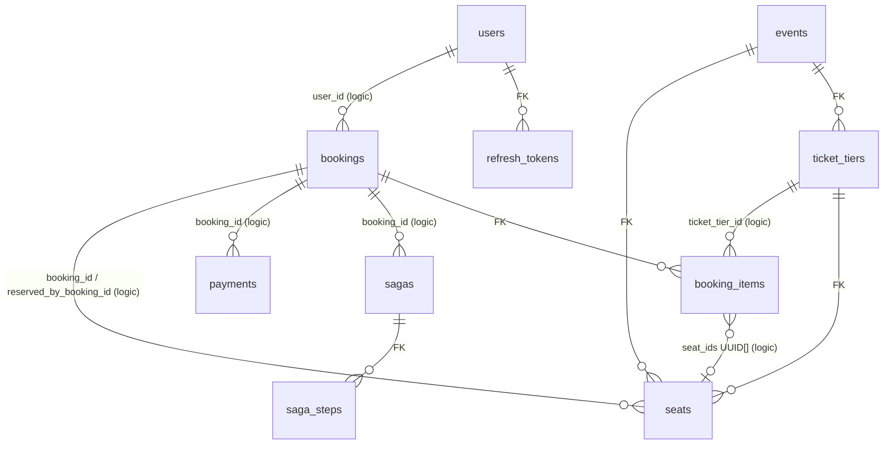
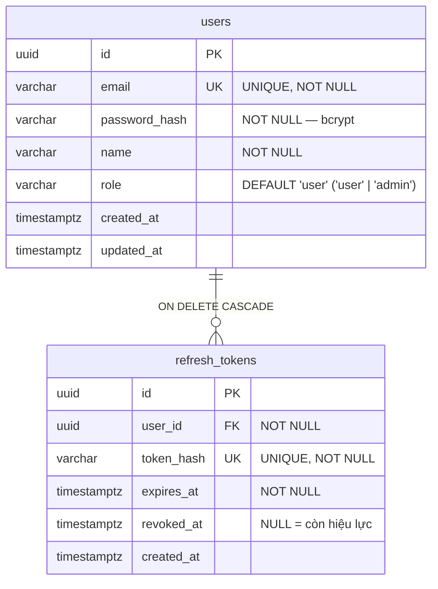
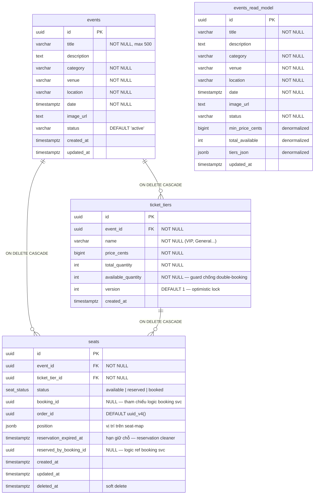
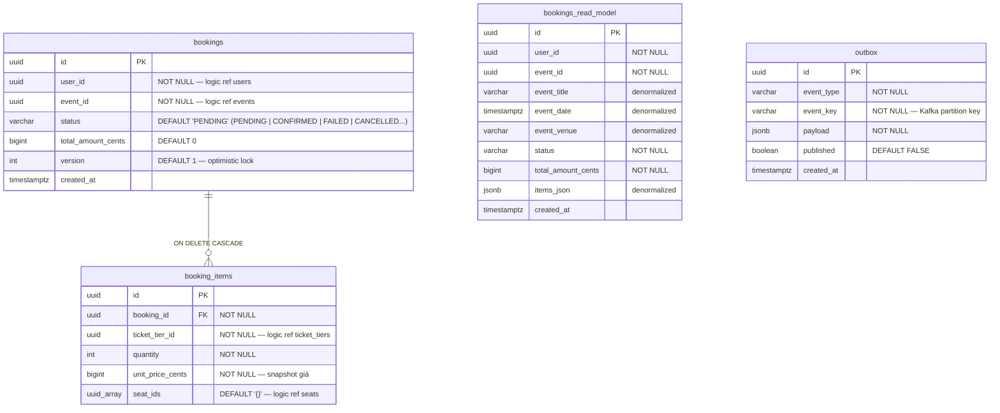
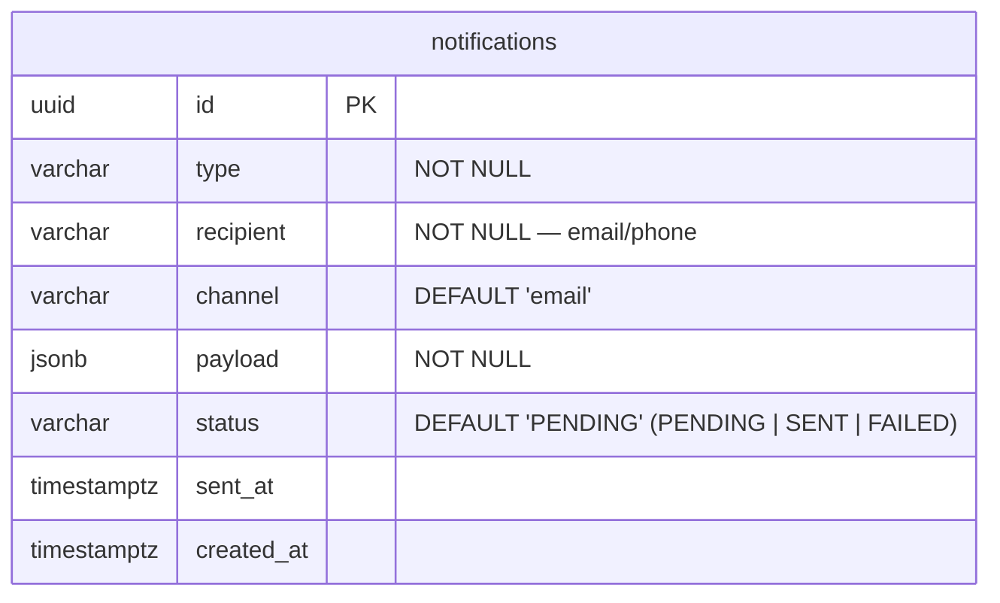
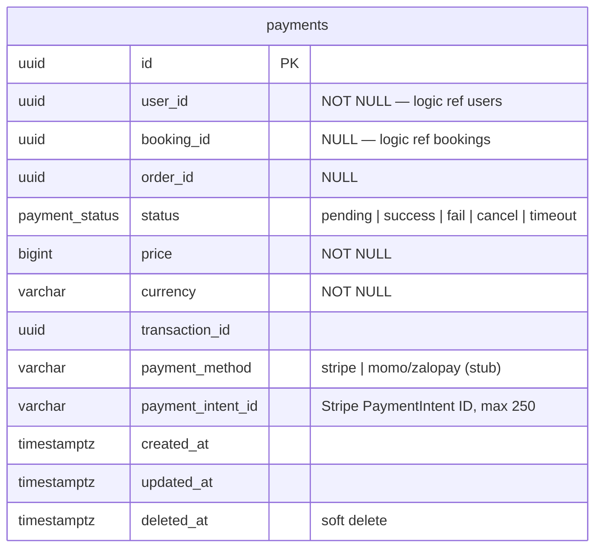
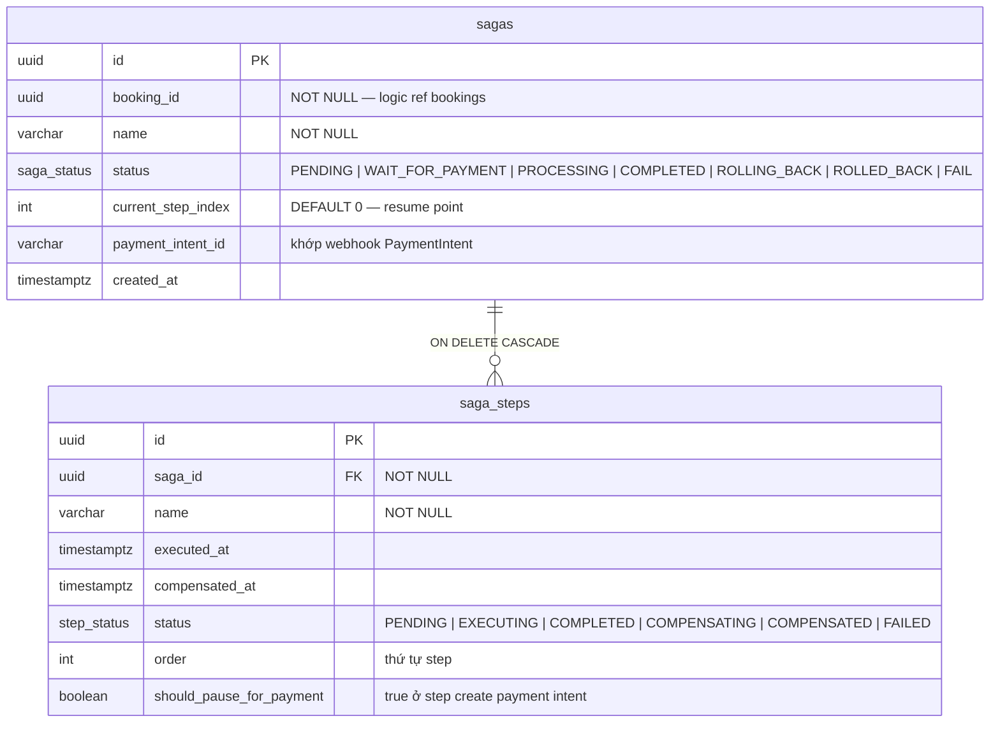
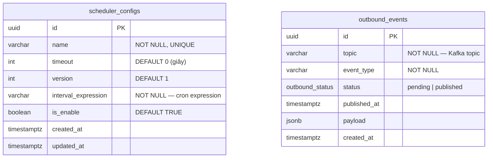

# Database ERD — TicketBox

> Nguồn: scan từ các migration files tại `backend/services/*/migrations/` (cập nhật 2026-09-08).
> Hệ thống dùng kiến trúc **database-per-service** — mỗi service có PostgreSQL riêng, nên **không có foreign key xuyên suốt giữa các service**. Các quan hệ chéo service (nét đứt trong sơ đồ tổng quan) là **tham chiếu logic theo UUID**.

## Tổng quan các databases

| Database | Service | Port | Tables |
|---|---|---|---|
| `ticketbox_user` | user | 5433 | `users`, `refresh_tokens` |
| `ticketbox_event` | event | 5434 | `events`, `ticket_tiers`, `seats`, `events_read_model` |
| `ticketbox_booking` | booking | 5435 | `bookings`, `booking_items`, `bookings_read_model`, `outbox` |
| `ticketbox_notification` | notification | 5436 | `notifications` |
| `ticketbox_payment` | payment | 5437 | `payments` |
| `ticketbox_saga` | saga | 5438 | `sagas`, `saga_steps` |
| `ticketbox_scheduler` | scheduler | — | `scheduler_configs`, `outbound_events` |

## Sơ đồ tổng quan (quan hệ logic chéo service)

```mermaid
erDiagram
    users ||--o{ refresh_tokens : "FK"
    users ||--o{ bookings : "user_id (logic)"
    events ||--o{ ticket_tiers : "FK"
    events ||--o{ seats : "FK"
    ticket_tiers ||--o{ seats : "FK"
    bookings ||--o{ booking_items : "FK"
    bookings ||--o{ sagas : "booking_id (logic)"
    sagas ||--o{ saga_steps : "FK"
    bookings ||--o{ payments : "booking_id (logic)"
    bookings ||--o{ seats : "booking_id / reserved_by_booking_id (logic)"
    ticket_tiers ||--o{ booking_items : "ticket_tier_id (logic)"
    booking_items }o--o| seats : "seat_ids UUID[] (logic)"
```

---

## 1. `ticketbox_user` — User Service (:50051)

```mermaid
erDiagram
    users {
        uuid id PK
        varchar email UK "UNIQUE, NOT NULL"
        varchar password_hash "NOT NULL — bcrypt"
        varchar name "NOT NULL"
        varchar role "DEFAULT 'user' ('user' | 'admin')"
        timestamptz created_at
        timestamptz updated_at
    }
    refresh_tokens {
        uuid id PK
        uuid user_id FK "NOT NULL"
        varchar token_hash UK "UNIQUE, NOT NULL"
        timestamptz expires_at "NOT NULL"
        timestamptz revoked_at "NULL = còn hiệu lực"
        timestamptz created_at
    }
    users ||--o{ refresh_tokens : "ON DELETE CASCADE"
```

**Indexes:** `idx_users_email(email)` · `idx_refresh_tokens_user_id(user_id)` · `idx_refresh_tokens_token_hash(token_hash)`

---

## 2. `ticketbox_event` — Event Service (:50052)

```mermaid
erDiagram
    events {
        uuid id PK
        varchar title "NOT NULL, max 500"
        text description
        varchar category "NOT NULL"
        varchar venue "NOT NULL"
        varchar location "NOT NULL"
        timestamptz date "NOT NULL"
        text image_url
        varchar status "DEFAULT 'active'"
        timestamptz created_at
        timestamptz updated_at
    }
    ticket_tiers {
        uuid id PK
        uuid event_id FK "NOT NULL"
        varchar name "NOT NULL (VIP, General...)"
        bigint price_cents "NOT NULL"
        int total_quantity "NOT NULL"
        int available_quantity "NOT NULL — guard chống double-booking"
        int version "DEFAULT 1 — optimistic lock"
        timestamptz created_at
    }
    seats {
        uuid id PK
        uuid event_id FK "NOT NULL"
        uuid ticket_tier_id FK "NOT NULL"
        seat_status status "available | reserved | booked"
        uuid booking_id "NULL — tham chiếu logic booking svc"
        uuid order_id "DEFAULT uuid_v4()"
        jsonb position "vị trí trên seat-map"
        timestamptz reservation_expired_at "hạn giữ chỗ — reservation cleaner"
        uuid reserved_by_booking_id "NULL — logic ref booking svc"
        timestamptz created_at
        timestamptz updated_at
        timestamptz deleted_at "soft delete"
    }
    events_read_model {
        uuid id PK
        varchar title "NOT NULL"
        text description
        varchar category "NOT NULL"
        varchar venue "NOT NULL"
        varchar location "NOT NULL"
        timestamptz date "NOT NULL"
        text image_url
        varchar status "NOT NULL"
        bigint min_price_cents "denormalized"
        int total_available "denormalized"
        jsonb tiers_json "denormalized"
        timestamptz updated_at
    }
    events ||--o{ ticket_tiers : "ON DELETE CASCADE"
    events ||--o{ seats : "ON DELETE CASCADE"
    ticket_tiers ||--o{ seats : "ON DELETE CASCADE"
```

**Enums:**
- `seat_status`: `available` | `reserved` | `booked`

**Indexes:** `idx_events_category`, `idx_events_date`, `idx_events_status` · `idx_ticket_tiers_event_id` · `idx_seats_event_id`, `idx_seats_tier_id`, `idx_seats_status` (partial `WHERE deleted_at IS NULL`) · `idx_seats_booking_id` (partial `WHERE booking_id IS NOT NULL`)

**Ghi chú:**
- `ticket_tiers.available_quantity` + `version` là cơ chế chống double-booking mức tier (pessimistic `SELECT ... FOR UPDATE` / optimistic theo `BOOKING_MODE`).
- `seats.reservation_expired_at` phục vụ job **reservation-cleaner** của scheduler service — hết hạn thì seat trả về `available`.
- `events_read_model` là read model denormalized cho truy vấn listing nhanh (CQRS-style).

---

## 3. `ticketbox_booking` — Booking Service (:50053)

```mermaid
erDiagram
    bookings {
        uuid id PK
        uuid user_id "NOT NULL — logic ref users"
        uuid event_id "NOT NULL — logic ref events"
        varchar status "DEFAULT 'PENDING' (PENDING | CONFIRMED | FAILED | CANCELLED...)"
        bigint total_amount_cents "DEFAULT 0"
        int version "DEFAULT 1 — optimistic lock"
        timestamptz created_at
    }
    booking_items {
        uuid id PK
        uuid booking_id FK "NOT NULL"
        uuid ticket_tier_id "NOT NULL — logic ref ticket_tiers"
        int quantity "NOT NULL"
        bigint unit_price_cents "NOT NULL — snapshot giá"
        uuid_array seat_ids "DEFAULT '{}' — logic ref seats"
    }
    bookings_read_model {
        uuid id PK
        uuid user_id "NOT NULL"
        uuid event_id "NOT NULL"
        varchar event_title "denormalized"
        timestamptz event_date "denormalized"
        varchar event_venue "denormalized"
        varchar status "NOT NULL"
        bigint total_amount_cents "NOT NULL"
        jsonb items_json "denormalized"
        timestamptz created_at
    }
    outbox {
        uuid id PK
        varchar event_type "NOT NULL"
        varchar event_key "NOT NULL — Kafka partition key"
        jsonb payload "NOT NULL"
        boolean published "DEFAULT FALSE"
        timestamptz created_at
    }
    bookings ||--o{ booking_items : "ON DELETE CASCADE"
```

**Indexes:** `idx_bookings_user_id`, `idx_bookings_event_id`, `idx_bookings_status` · `idx_booking_items_booking_id` · `idx_bookings_read_user_id` · `idx_outbox_unpublished` (partial `WHERE published = FALSE`)

**Ghi chú:**
- `outbox` implement **transactional outbox pattern** — event chỉ publish ra Kafka sau khi DB transaction commit thành công (at-least-once).
- `bookings_read_model` denormalize dữ liệu event (title/date/venue) để trang my-tickets không cần gọi sang event service.

---

## 4. `ticketbox_notification` — Notification Service

```mermaid
erDiagram
    notifications {
        uuid id PK
        varchar type "NOT NULL"
        varchar recipient "NOT NULL — email/phone"
        varchar channel "DEFAULT 'email'"
        jsonb payload "NOT NULL"
        varchar status "DEFAULT 'PENDING' (PENDING | SENT | FAILED)"
        timestamptz sent_at
        timestamptz created_at
    }
```

**Indexes:** `idx_notifications_status` · `idx_notifications_recipient`

**Ghi chú:** notification là Kafka consumer thuần (không có gRPC), ghi nhận notification cần gửi và trạng thái đã gửi.

---

## 5. `ticketbox_payment` — Payment Service (:50054 gRPC / :8081 HTTP)

```mermaid
erDiagram
    payments {
        uuid id PK
        uuid user_id "NOT NULL — logic ref users"
        uuid booking_id "NULL — logic ref bookings"
        uuid order_id "NULL"
        payment_status status "pending | success | fail | cancel | timeout"
        bigint price "NOT NULL"
        varchar currency "NOT NULL"
        uuid transaction_id
        varchar payment_method "stripe | momo/zalopay (stub)"
        varchar payment_intent_id "Stripe PaymentIntent ID, max 250"
        timestamptz created_at
        timestamptz updated_at
        timestamptz deleted_at "soft delete"
    }
```

**Enums:**
- `payment_status`: `pending` | `success` | `fail` | `cancel` | `timeout`

**Ghi chú:** kết quả payment đi qua Stripe webhook (:8081) → Kafka → saga consumer, không có FK sang booking.

---

## 6. `ticketbox_saga` — Saga Service (:50055)

```mermaid
erDiagram
    sagas {
        uuid id PK
        uuid booking_id "NOT NULL — logic ref bookings"
        varchar name "NOT NULL"
        saga_status status "PENDING | WAIT_FOR_PAYMENT | PROCESSING | COMPLETED | ROLLING_BACK | ROLLED_BACK | FAIL"
        int current_step_index "DEFAULT 0 — resume point"
        varchar payment_intent_id "khớp webhook PaymentIntent"
        timestamptz created_at
    }
    saga_steps {
        uuid id PK
        uuid saga_id FK "NOT NULL"
        varchar name "NOT NULL"
        timestamptz executed_at
        timestamptz compensated_at
        step_status status "PENDING | EXECUTING | COMPLETED | COMPENSATING | COMPENSATED | FAILED"
        int order "thứ tự step"
        boolean should_pause_for_payment "true ở step create payment intent"
    }
    sagas ||--o{ saga_steps : "ON DELETE CASCADE"
```

**Enums:**
- `saga_status`: `PENDING` | `WAIT_FOR_PAYMENT` | `PROCESSING` | `COMPLETED` | `ROLLING_BACK` | `ROLLED_BACK` | `FAIL`
- `step_status`: `PENDING` | `EXECUTING` | `COMPLETED` | `COMPENSATING` | `COMPENSATED` | `FAILED`

**Ghi chú:** saga pause/reseme qua payment webhook — state được persist tại đây và rebuild (`reBuildSagaHandler`) khi resume từ `current_step_index + 1`. `payment_intent_id` dùng để khớp event payment webhook với đúng saga.

---

## 7. `ticketbox_scheduler` — Scheduler Service

```mermaid
erDiagram
    scheduler_configs {
        uuid id PK
        varchar name "NOT NULL, UNIQUE"
        int timeout "DEFAULT 0 (giây)"
        int version "DEFAULT 1"
        varchar interval_expression "NOT NULL — cron expression"
        boolean is_enable "DEFAULT TRUE"
        timestamptz created_at
        timestamptz updated_at
    }
    outbound_events {
        uuid id PK
        varchar topic "NOT NULL — Kafka topic"
        varchar event_type "NOT NULL"
        outbound_status status "pending | published"
        timestamptz published_at
        jsonb payload
        timestamptz created_at
    }
```

**Enums:**
- `outbound_status`: `pending` | `published`

**Ghi chú:**
- `scheduler_configs` cấu hình động các cronjob (VD: `reservation-cleaner` dọn seat hết hạn) — cron interval, timeout, bật/tắt.
- `outbound_events` là outbox của scheduler: event sinh ra từ job chỉ publish Kafka sau khi commit, đảm bảo at-least-once.

---

## Bản đồ tham chiếu logic chéo service (không có FK)

| Cột (table @ service) | Tham chiếu logic tới | Ghi chú |
|---|---|---|
| `bookings.user_id` @ booking | `users.id` @ user | |
| `bookings.event_id` @ booking | `events.id` @ event | |
| `booking_items.ticket_tier_id` @ booking | `ticket_tiers.id` @ event | |
| `booking_items.seat_ids[]` @ booking | `seats.id` @ event | UUID array |
| `seats.booking_id`, `seats.reserved_by_booking_id` @ event | `bookings.id` @ booking | |
| `payments.user_id` @ payment | `users.id` @ user | |
| `payments.booking_id` @ payment | `bookings.id` @ booking | |
| `sagas.booking_id` @ saga | `bookings.id` @ booking | |
| `sagas.payment_intent_id` @ saga | Stripe PaymentIntent | khớp webhook |

> Tính toàn vẹn chéo service được đảm bảo bởi **saga orchestration** (compensating actions khi một bước fail), không phải ràng buộc DB.

---

## Quy ước chung

| Quy ước | Mô tả |
|---|---|
| UUID Primary Keys | Tất cả bảng dùng UUID v4 (`uuid-ossp` extension) |
| `*_cents` | Tiền tệ lưu số nguyên cents (`price_cents`, `total_amount_cents`) tránh sai số float |
| `*_at` | Timestamp dùng `TIMESTAMPTZ` (timezone-aware) |
| `version` | Optimistic locking counter |
| `deleted_at` | Soft delete (`seats`, `payments`) |
| `*_json` / JSONB | Payload/ dữ liệu denormalized |
| Read models | `events_read_model`, `bookings_read_model` — CQRS-style denormalization |
| Outbox | `outbox` @ booking, `outbound_events` @ scheduler — transactional outbox → Kafka |

## Migrations

Dùng **golang-migrate** (up/down) tại `backend/services/{name}/migrations/`. Chạy tất cả: `make migrate` từ `backend/`.
